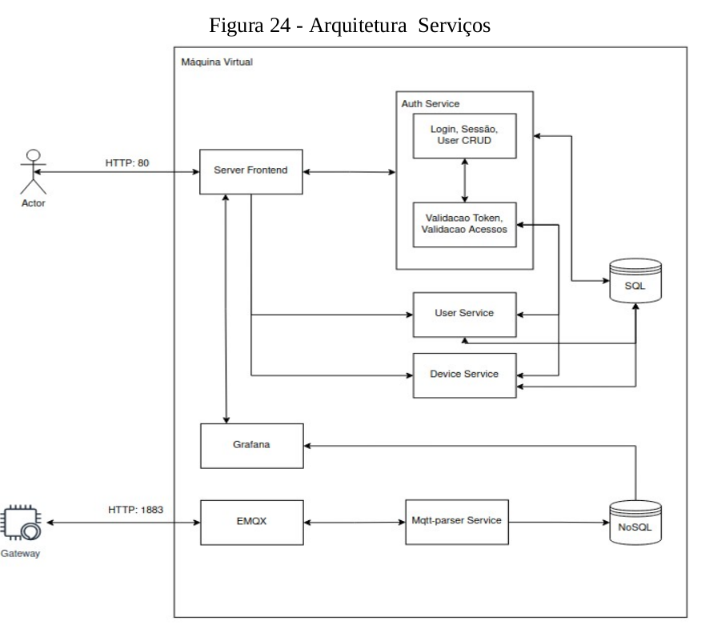

# Match-IO

[Full Papper](./match-io_papper_Felipe-Grings.pdf)

[Video Presentation](https://www.youtube.com/watch?v=z5Odm_62vqk)

The main goal of this papper is to carry out a comprehensive study of the concept of Internet of Things and the technologies that surround it. The papper explores several architectures aimed at optimizing the concept of IoT (Internet of Things) used for long-term communication reach, aiming at a system that is simple to install for the end user. A bibliographical review on protocols, architectures, distributions is presented with components and the importance for the small farmer and industry of monitor their environment variables to optimize their processes. From the perception of a lack availability of products that consider the usability and installation, using these technologies of accessible to businesses and farmers who do not have high financial resources for such implementation. Faced with this problem, the proposal of the papper is to develop a prototype that delivers a product to the final consumer. End-to-End, no third-party setup required and easy to install, independent of Internet connection, and ready to use embedded in local servers or provided by suppliers. For this, a development methodology is used in stages, where the hardware and firmware product, the high level software product such as database, communication services HTTP and user interfaces, as well as scripting for the infrastructure run as code. Thus, technologies such as LoRa are used, to long-distance communication, MQTT for messaging services, Python and Flask for high-level services, among other technologies to simplify the development. This makes it possible to implement the prototype for monitoring of physical quantities, as well as transmission to a database for future analysis and understanding of the environment. To prove the efficiency and the reliability of the system, continuous tests were carried out over 6 months in real use situation in a aviary environment. The results obtained showed the rate of messages sent with real success over 84.56% ideal and an average approval of 4 out of 5 among users in usability and implementation of the system. These tests prove the correct working of the proposed system.

### Software Requirements

Python3

AVR-GCC Compiler

Docker

Docker Swarm

PlatformIO

### Hardware Requirements

HELTEC LoRa ESP32 V2

Transdutor BME380

## Install

#### Software

```bash
git clone ...
cd match-io/web
./run.sh
```

#### Hardware

Import projects on Platform IO and deploy to microcontrolers 

## Results

### Architecture




### Hardware


### Final Results


### Authors and acknowledgment

https://github.com/fhgrings

### License

MIT
